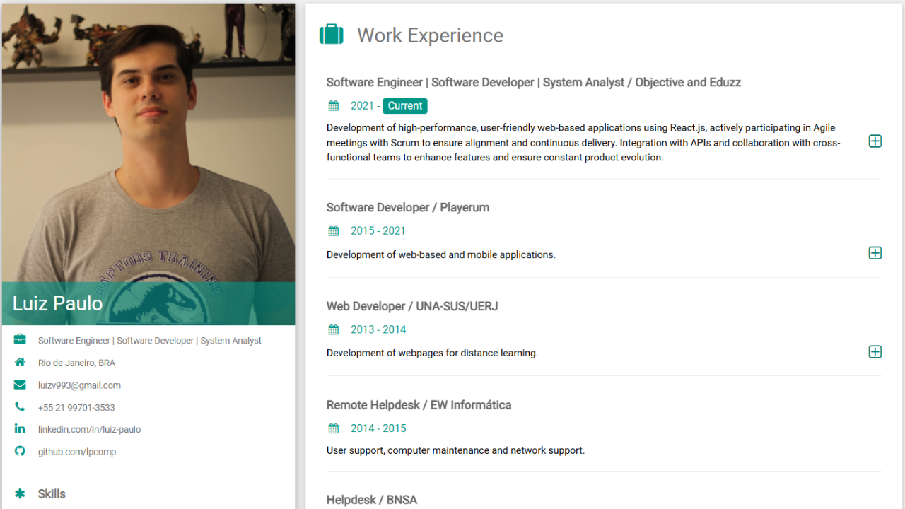

# Portfolio

Este é um projeto de portfólio pessoal criado com **HTML**, **CSS** (com ajustes baseados no framework da W3Schools) e **JavaScript vanilla**. A interface foi inicialmente baseada em um template fornecido pela W3Schools, mas foi adaptada e personalizada para atender às minhas necessidades.

---

## 🎨 Funcionalidades

- Apresentação de projetos com design clean e responsivo.
- Seção "Sobre Mim" detalhando minhas habilidades e experiência.
- Links para redes sociais e formas de contato.
- Galeria de projetos com descrições personalizadas.
- Personalizações estéticas no template original da W3Schools para refletir minha identidade.

---

## 🚀 Tecnologias Utilizadas

- **HTML5**: Estrutura básica da página.
- **CSS3**: Estilização customizada baseada no template da W3Schools.
- **JavaScript Vanilla**: Funcionalidades dinâmicas e interativas.
- **CDN da W3Schools**: Fornecendo estilos base prontos para otimização do tempo de desenvolvimento.

---

## 🛠️ Como Executar

1. **Clone o repositório**:
   ```bash
   git clone https://github.com/lpcomp/portfolio.git
   abra o index.html em um navegador

---

## 📸 Captura de tela

